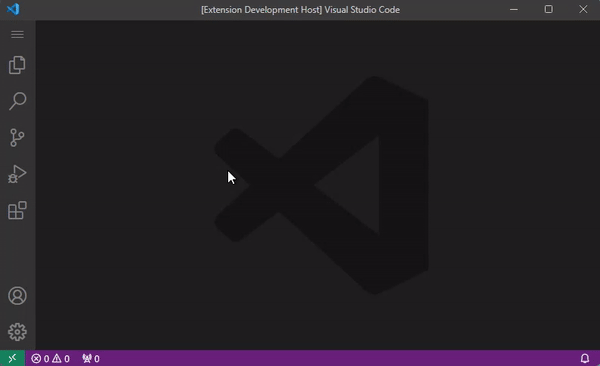

#  vsc-2fa

A Two-Factor Authentication (2FA) manager extension for Visual Studio Code.

***This extension is without any server side.***

***Due to the synchronization of VSCode Extensions not always work well, back up data frequently is recommended.***

Get from 
[Marketplace](https://marketplace.visualstudio.com/items?itemName=cai-qichang.vsc-2fa) 
or 
[OpenVSX](https://open-vsx.org/extension/cai-qichang/vsc-2fa)

## Features
- Multiple 2FA keys management support
- User data synchronization support (via Visual Studio Code Extensions Synchronization)
- User data export support
- Base64 Convertor
- Regular Expression Test

## Usage
- Using command `2fa` to open 2FA Manager Pannel.

## Donation
Support me by AFDIAN: https://afdian.com/a/caiqichang
